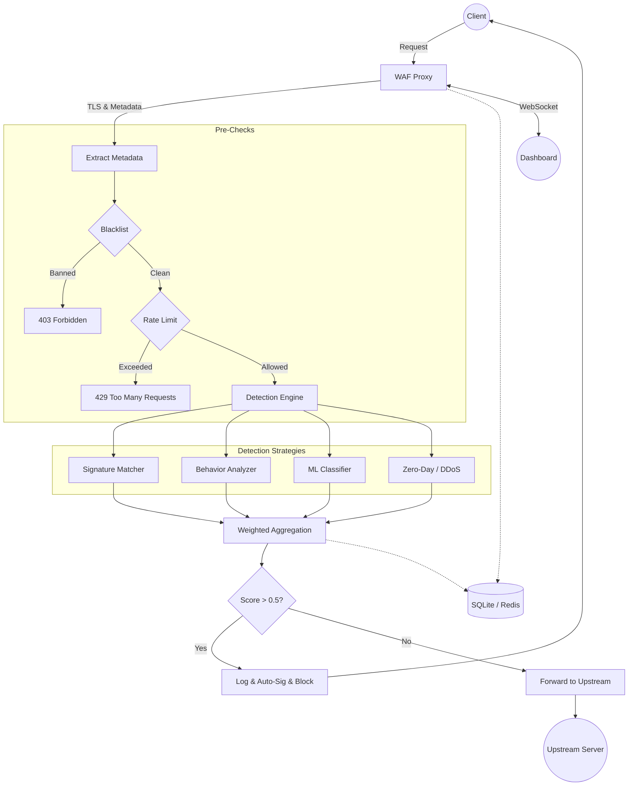

# AI-WAF: Intelligent Web Application Firewall

An AI-enhanced Web Application Firewall (WAF) implemented as a reverse proxy combining signature-based detection, machine learning classification, and behavioral analysis for comprehensive web application protection.

## Features

- **Multi-Strategy Detection Engine**: Three complementary strategies operating in parallel:
  - **Signature Matching**: 106 patterns across 9 attack categories (SQL Injection, XSS, Command Injection, Path Traversal, File Inclusion, DOM-XSS, SSTI, SSI, XXE)
  - **Behavioral Analysis**: Per-IP request profiling with sliding window anomaly detection
  - **Machine Learning**: Logistic regression model trained on 8 traffic features for false positive reduction

- **Automatic Signature Generation**: Pattern extraction from blocked requests across 4 categories with admin review workflow

- **Real-Time Monitoring Dashboard**: WebSocket-based live updates with 9 analytical tabs, interactive charts, and IP management

- **Performance Optimized**: Async database operations with connection pooling (max 10 connections) and batched log writing

- **Distributed Caching**: Optional Redis integration for rate limiting and blacklist synchronization

- **TLS/SSL Support**: HTTPS termination with configurable certificates and self-signed generation

## Architecture

The system follows a layered architecture designed for high performance, modularity, and security.



### Core Layers

#### 1. Proxy Layer (`main.py`, `proxy.py`)
- **Entry Point:** Intercepts all incoming HTTP/HTTPS requests.
- **TLS Termination:** Handles SSL/TLS decryption for deep packet inspection.
- **Metadata Extraction:** Parses HTTP method, path, query string, headers, and a 500-byte body preview.
- **Forwarding:** Injects `X-WAF-Analyzed` header and forwards clean traffic to the upstream server via HTTPX.
- **IP Extraction:** Identifies real client IP via `X-Forwarded-For` or socket address.

#### 2. Detection Engine (`strategies/`, `ml_model.py`)
Executes strategies in parallel to minimize latency:
- **Signature Matcher:** Checks request against **106 patterns** across **9 categories** (SQLi, XSS, Command Injection, etc.) using regex.
- **Behavior Analyzer:** Monitors per-IP request frequency and path diversity using sliding windows to detect scanning and brute-force.
- **ML Classifier:** Logistic Regression model analyzing **8 traffic features** for probabilistic classification.
- **Zero-Day / DDoS:** Statistical entropy analysis for unknown threats and multi-layered flood mitigation (per-IP and global limits).
- **Aggregation:** Combines strategy results using weighted scoring (AI agents 1.5x, standard 1.0x). **Decision:** Block if Threat Score > 0.5.

#### 3. Data Layer (`database.py`, `async_database.py`, `redis_cache.py`)
- **Async SQLite:** Uses `aiosqlite` with a connection pool (max 10 connections).
- **Batch Writer:** Accumulates logs in memory and flushes to disk every **5 seconds** to reduce I/O overhead.
- **Redis Cache:** Optional distributed storage for rate limiting and blacklist synchronization with automatic in-memory fallback.

#### 4. Presentation Layer (`static/dashboard.html`)
- **Real-time Dashboard:** A comprehensive web interface with 9 analytical tabs (Overview, Logs, Blacklist, ML, etc.).
- **WebSocket:** Streams live request logs and security events to the UI with sub-second latency.
- **REST API:** Provides endpoints for configuration, historical data retrieval, and threat analytics.

## Tech Stack

| Category | Technology |
|----------|-----------|
| **Runtime** | Python 3.12+ |
| **Framework** | FastAPI 0.115+ |
| **Proxy** | HTTPX 0.27+ |
| **Database** | SQLite + aiosqlite 0.20+ |
| **Cache** | Redis 7.0+ (optional) |
| **ML** | Scikit-learn 1.5+, NumPy 1.26+ |
| **Security** | cryptography 43.0+ |
| **Testing** | pytest 8.0+, pytest-asyncio |
| **Deployment** | Docker, Docker Compose, GitHub Actions |

## Quick Start

### Prerequisites
- Python 3.12 or higher
- Docker & Docker Compose (optional, for containerized deployment)

### Installation

1. Clone the repository:
```bash
git clone https://github.com/fouadbehtaher/waff-app-new.git
cd waff-app-new
```

2. Create a virtual environment and install dependencies:
```bash
python -m venv venv
source venv/bin/activate  # On Windows: venv\Scripts\activate
pip install -r src/waf/requirements.txt
pip install -r tests/requirements-test.txt
```

3. Configure environment variables:
```bash
cp .env.example .env
# Edit .env with your configuration
```

4. Run the WAF server:
```bash
cd src/waf
python main.py
```

The WAF will start on `http://localhost:8000` (or `https://localhost:8443` if TLS is configured).

### Docker Deployment

```bash
docker-compose up -d
```

### Dashboard Access

Open your browser and navigate to:
- `http://localhost:8000/dashboard` (HTTP)
- `https://localhost:8443/dashboard` (HTTPS)

## Configuration

All settings are configurable via environment variables or the `.env` file:

| Variable | Default | Description |
|----------|---------|-------------|
| `UPSTREAM_URL` | `http://localhost:8080` | Target backend server |
| `RATE_LIMIT_MAX_REQUESTS` | `100` | Max requests per window |
| `RATE_LIMIT_WINDOW_SECONDS` | `60` | Time window in seconds |
| `BLACKLIST_THRESHOLD` | `5` | Violations before auto-ban |
| `BLACKLIST_DURATION_MINUTES` | `60` | Temporary ban duration |
| `USE_ASYNC_DB` | `true` | Enable async database operations |
| `USE_REDIS` | `false` | Enable Redis caching |
| `TLS_CERT_PATH` | None | Path to TLS certificate |
| `TLS_KEY_PATH` | None | Path to TLS private key |

## Detection Categories

| Category | Threat Level | Pattern Count |
|----------|-------------|---------------|
| SQL Injection | HIGH | 10 |
| XSS | MEDIUM | 14 |
| DOM-XSS | HIGH | 28 |
| SSTI | HIGH | 14 |
| SSI | MEDIUM | 7 |
| XXE/XML | CRITICAL | 15 |
| Command Injection | CRITICAL | 10 |
| File Inclusion | HIGH | 9 |
| File Upload | HIGH | 9 |
| **Total** | | **106** |

## Machine Learning Model

- **Algorithm**: Logistic Regression (gradient descent)
- **Features**: 8 traffic features (path length, query length, body length, special chars, SQL keywords, script tags, traversal, command chars)
- **Training**: Up to 10,000 samples from accumulated logs
- **Persistence**: Model weights stored as JSON for fast inference

## Testing

Run the full test suite:

```bash
pytest tests/ -v
```

The project includes comprehensive tests covering:
- Database CRUD operations and cleanup
- Blacklist management and auto-ban
- Signature pattern matching across all categories
- ML feature extraction, training, and prediction
- Auto-signature generation workflow
- Redis cache with fallback behavior
- TLS certificate generation
- Async connection pooling
- End-to-end integration flows
- Zero-day anomaly detection
- DDoS flood mitigation

## Project Structure

```
waff-app-new/
├── src/waf/              # Main application source
│   ├── ai_engine/        # AI/ML integration
│   ├── models/           # Data models
│   ├── strategies/       # Detection strategies
│   ├── static/           # Dashboard frontend
│   ├── main.py           # FastAPI entry point
│   ├── proxy.py          # Reverse proxy engine
│   ├── ml_model.py       # Logistic regression model
│   ├── database.py       # SQLite manager
│   └── config.py         # Application settings
├── tests/                # Unit & integration tests
├── infra/                # Azure Bicep infrastructure
├── report/               # Project documentation
├── .github/workflows/    # CI/CD pipeline
├── Dockerfile            # Container build
└── docker-compose.yml    # Multi-service orchestration
```

## License

This project is for academic and educational purposes.
