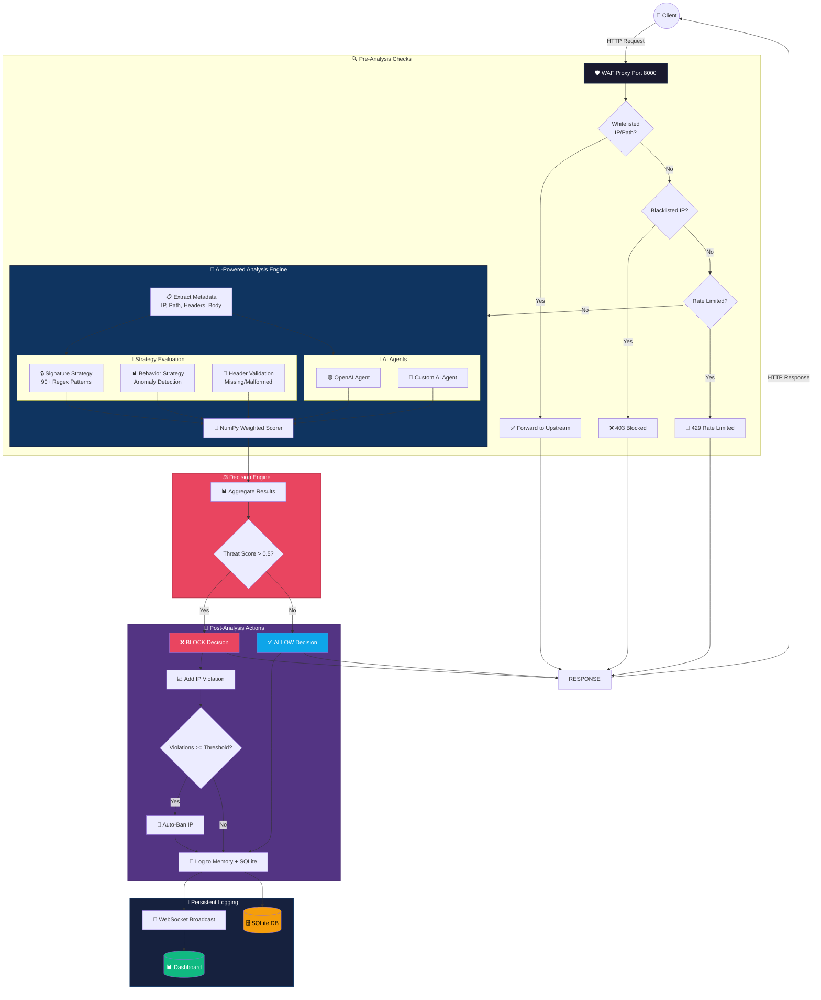
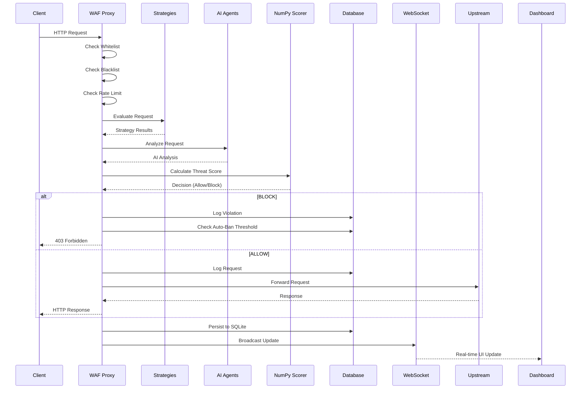
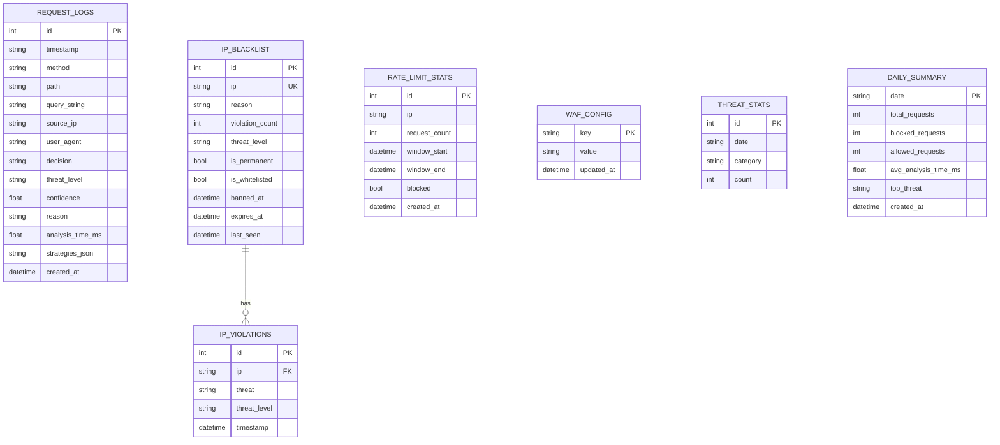

# WAF Architecture & Flow

## Request Flow Chart

```mermaid
flowchart TD
    Client((👤 Client)) -->|HTTP Request| LB[🛡️ WAF Proxy Port 8000]
    
    subgraph PreChecks["🔍 Pre-Analysis Checks"]
        LB --> WL{Whitelisted<br/>IP/Path?}
        WL -->|Yes| FWD[✅ Forward to Upstream]
        WL -->|No| BL{Blacklisted IP?}
        BL -->|Yes| BLK1[❌ 403 Blocked]
        BL -->|No| RL{Rate Limited?}
        RL -->|Yes| RLK[🚫 429 Rate Limited]
        RL -->|No| ANALYSIS
    end
    
    subgraph ANALYSIS["🧠 AI-Powered Analysis Engine"]
        direction TB
        EXTRACT[📋 Extract Metadata<br/>IP, Path, Headers, Body]
        
        EXTRACT --> STRAT
        EXTRACT --> AIAgent
        
        subgraph STRAT["📜 Strategy Evaluation"]
            SIG[🔒 Signature Strategy<br/>90+ Regex Patterns]
            BEH[📊 Behavior Strategy<br/>Anomaly Detection]
            HDR[📨 Header Validation<br/>Missing/Malformed]
        end
        
        subgraph AIAgent["🤖 AI Agents"]
            OPENAI[🟢 OpenAI Agent]
            CUSTOM[🔵 Custom AI Agent]
        end
        
        SIG --> SCORER
        BEH --> SCORER
        HDR --> SCORER
        OPENAI --> SCORER
        CUSTOM --> SCORER
    end
    
    subgraph SCORING["⚖️ Decision Engine"]
        SCORER[🧮 NumPy Weighted Scorer]
        SCORER --> AGG[📊 Aggregate Results]
        AGG --> DECISION{Threat Score > 0.5?}
    end
    
    DECISION -->|Yes| BLOCK[❌ BLOCK Decision]
    DECISION -->|No| ALLOW[✅ ALLOW Decision]
    
    subgraph POST["📝 Post-Analysis Actions"]
        BLOCK --> VIOLATION[📈 Add IP Violation]
        VIOLATION --> BAN_CHECK{Violations >= Threshold?}
        BAN_CHECK -->|Yes| BAN[🚫 Auto-Ban IP]
        BAN_CHECK -->|No| LOG
        ALLOW --> LOG
        
        BAN --> LOG
    end
    
    subgraph LOGGING["💾 Persistent Logging"]
        LOG[📝 Log to Memory + SQLite]
        LOG --> WS[🔄 WebSocket Broadcast]
        LOG --> DB[(🗄️ SQLite DB)]
        WS --> DASH[(📊 Dashboard)]
    end
    
    FWD --> RESPONSE
    ALLOW --> RESPONSE
    BLOCK --> RESPONSE
    BLK1 --> RESPONSE
    RLK --> RESPONSE
    
    RESPONSE -->|HTTP Response| Client
    
    style LB fill:#1a1a2e,color:#fff,stroke:#16213e,stroke-width:3px
    style ANALYSIS fill:#0f3460,color:#fff,stroke:#16213e,stroke-width:2px
    style SCORING fill:#e94560,color:#fff,stroke:#c23a51,stroke-width:2px
    style POST fill:#533483,color:#fff,stroke:#4a2d73,stroke-width:2px
    style LOGGING fill:#16213e,color:#fff,stroke:#0f3460,stroke-width:2px
    style BLOCK fill:#e94560,color:#fff
    style ALLOW fill:#0ea5e9,color:#fff
    style DB fill:#f59e0b,color:#000
    style DASH fill:#10b981,color:#fff
```

## Component Architecture

```mermaid
graph LR
    subgraph FRONTEND["🖥️ Frontend"]
        DASH[Dashboard HTML]
        WS_CLIENT[WebSocket Client]
    end
    
    subgraph BACKEND["🛡️ WAF Backend (FastAPI)"]
        API[FastAPI Routes]
        PROXY[WAF Proxy Handler]
        CONFIG[WAF Config Manager]
    end
    
    subgraph ENGINE["🧠 Analysis Engine"]
        SIG[Signature Strategy]
        BEH[Behavior Strategy]
        HDR[Header Validation]
        RL[Rate Limiter]
        AI[AI Agents<br/>OpenAI/Custom]
        SCORER[NumPy Scorer]
        BL[IP Blacklist]
    end
    
    subgraph STORAGE["💾 Storage"]
        SQLITE[(SQLite DB)]
        MEMORY[In-Memory Cache]
    end
    
    DASH --> API
    WS_CLIENT --> API
    API --> PROXY
    API --> CONFIG
    PROXY --> ENGINE
    ENGINE --> STORAGE
    API --> STORAGE
    
    style FRONTEND fill:#1e293b,color:#fff
    style BACKEND fill:#334155,color:#fff
    style ENGINE fill:#475569,color:#fff
    style STORAGE fill:#0f172a,color:#fff
```

## Data Flow Sequence

```mermaid
sequenceDiagram
    participant C as Client
    participant W as WAF Proxy
    participant S as Strategies
    participant A as AI Agents
    participant SC as NumPy Scorer
    participant D as Database
    participant WS as WebSocket
    participant U as Upstream
    
    C->>W: HTTP Request
    W->>W: Check Whitelist
    W->>W: Check Blacklist
    W->>W: Check Rate Limit
    
    W->>S: Evaluate Request
    S-->>W: Strategy Results
    
    W->>A: Analyze Request
    A-->>W: AI Analysis
    
    W->>SC: Calculate Threat Score
    SC-->>W: Decision (Allow/Block)
    
    alt BLOCK
        W->>D: Log Violation
        W->>D: Check Auto-Ban Threshold
        W-->>C: 403 Forbidden
    else ALLOW
        W->>D: Log Request
        W->>U: Forward Request
        U-->>W: Response
        W-->>C: HTTP Response
    end
    
    W->>D: Persist to SQLite
    W->>WS: Broadcast Update
    WS-->>Dashboard: Real-time UI Update
```

## Database Schema

```mermaid
erDiagram
    REQUEST_LOGS {
        int id PK
        string timestamp
        string method
        string path
        string query_string
        string source_ip
        string user_agent
        string decision
        string threat_level
        float confidence
        string reason
        float analysis_time_ms
        string strategies_json
        datetime created_at
    }
    
    IP_BLACKLIST {
        int id PK
        string ip UK
        string reason
        int violation_count
        string threat_level
        bool is_permanent
        bool is_whitelisted
        datetime banned_at
        datetime expires_at
        datetime last_seen
    }
    
    IP_VIOLATIONS {
        int id PK
        string ip FK
        string threat
        string threat_level
        datetime timestamp
    }
    
    RATE_LIMIT_STATS {
        int id PK
        string ip
        int request_count
        datetime window_start
        datetime window_end
        bool blocked
        datetime created_at
    }
    
    WAF_CONFIG {
        string key PK
        string value
        datetime updated_at
    }
    
    THREAT_STATS {
        int id PK
        string date
        string category
        int count
    }
    
    DAILY_SUMMARY {
        string date PK
        int total_requests
        int blocked_requests
        int allowed_requests
        float avg_analysis_time_ms
        string top_threat
        datetime created_at
    }
    
    IP_BLACKLIST ||--o{ IP_VIOLATIONS : "has"
```
